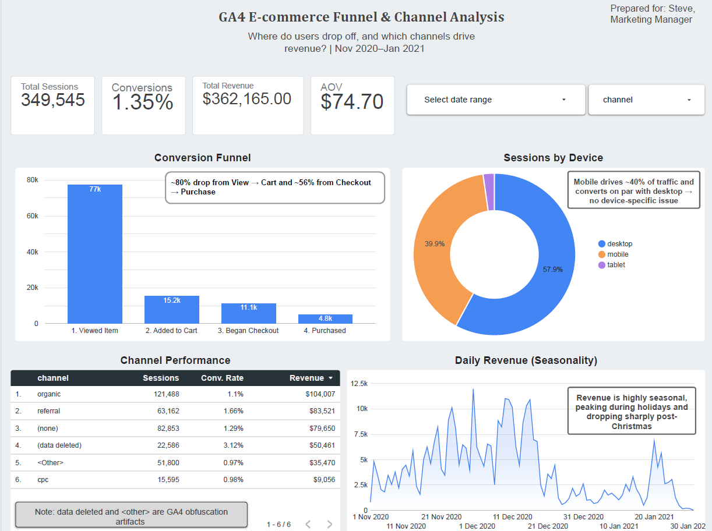

# GA4 E-commerce Funnel & Channel Analysis

**[🔗 View the live interactive dashboard](https://datastudio.google.com/reporting/918adeb6-ea43-445e-ae17-96ac21db6156)**

*One-line hook:* Analysis of ~350K sessions of Google Merchandise Store clickstream data to identify funnel drop-offs, channel efficiency, and revenue drivers.



---

## The Business Problem

Steve, a Marketing Manager at an e-commerce brand, is facing a frustrating issue:
**traffic is growing, but revenue feels inconsistent.**

Despite increasing user sessions, conversions remain low and unpredictable. Steve needs to understand:

* Where users drop off in the purchase journey
* Which channels bring buyers vs. just browsers

---

## The Question

1. **Where do users drop out of the purchase funnel (view → cart → checkout → purchase)?**
2. **Which acquisition channels drive high-quality traffic and revenue?**

---

## Data

* **Source:** GA4 Obfuscated Sample E-commerce Dataset (BigQuery Public Dataset)
* **Scale:** ~4.3M events · ~270K users · ~350K sessions
* **Time Range:** Nov 2020 – Jan 2021 (92 daily tables)
* **Tools Used:** BigQuery (SQL) → Looker Studio → GitHub

---

## Key Findings

1. **Checkout is the biggest revenue leak:** ~56% of users who *begin checkout* don’t complete the purchase — high-intent users are lost at the final step.

2. **Revenue is seasonal, not inconsistent:** Peaks during **Black Friday → mid-December**, then drops sharply after the **holiday shipping cutoff**, leading to a January slump.

3. **Channel quality ≠ volume:** Organic drives the most traffic, but **referral converts 51% better (1.66% vs 1.10%)**. Paid (CPC) performs worst (0.98%) despite costing money — clear inefficiency.

4. **No device penalty:** Mobile (~40% of traffic) converts on par with desktop (~6.5% vs ~6.1%), meaning funnel issues are **device-agnostic**, not UX-specific.

5. **High-interest products fail to convert:** Multiple products have **30K–50K+ views but near-zero purchases**, indicating strong demand but broken conversion (pricing, UX, or availability issues).

---

## Recommendations

* **Fix checkout friction first:** Simplify payment flow, reduce steps, and optimize UX to recover high-intent users.

* **Shift acquisition strategy:** Invest more in high-converting channels (referral) and audit underperforming paid campaigns (CPC).

* **Plan around seasonality:**

  * Increase ad spend and inventory before Black Friday and early December
  * Use January for retention campaigns and clearance strategies

* **Optimize product pages:** Improve pricing, visuals, and descriptions for high-view, low-conversion products before investing in new traffic.

* **Avoid unnecessary mobile rebuilds:** Since performance is consistent across devices, focus on universal funnel improvements instead.

---

## How It Was Built

* Built using **BigQuery SQL** to transform raw GA4 event-level data into session-level analysis tables
* Created a **session_summary table** to track funnel progression and revenue
* Conducted 3 deep-dive analyses:

  * Funnel performance by device
  * Revenue seasonality trends
  * Product-level conversion gaps
* Designed an interactive dashboard in **Looker Studio** to present insights

Explore SQL queries in [`/sql`](sql/)
Explore detailed insights in [`/docs`](docs/)

---

## Repo Structure

```bash
ga4-ecommerce-funnel-analysis/
│
├── docs/
│   ├── dashboard.png
│   ├── data_dictionary.md
│   ├── insight_1.md
│   ├── insight_2.md
│   └── insight_3.md
│
├── sql/
│   ├── 01_funnel_overview.sql
│   ├── 02_channel_conversion.sql
│   ├── 03_revenue_by_channel.sql
│   ├── 04_funnel_by_device.sql
│   ├── 05_view_vs_purchase_products.sql
│   ├── 06_daily_revenue_trend.sql
│   ├── 07_session_summary_table.sql
│   └── 08_funnel_steps_long.sql
│
├── README.md
└── LICENSE
```

---

## Final Thoughts

This project demonstrates how raw clickstream data can be transformed into **clear business decisions**.

The focus was not just on writing SQL, but on:

* Asking the right questions
* Challenging assumptions
* Translating data into actionable insights

---
